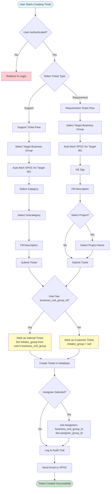
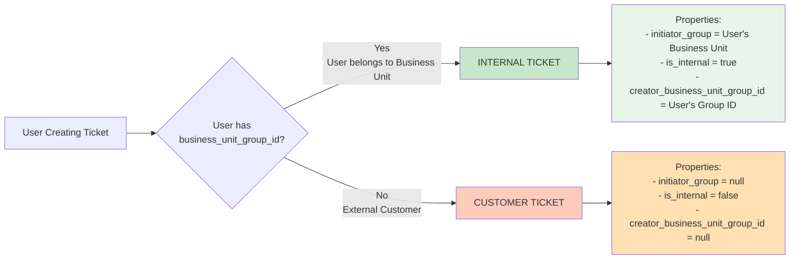
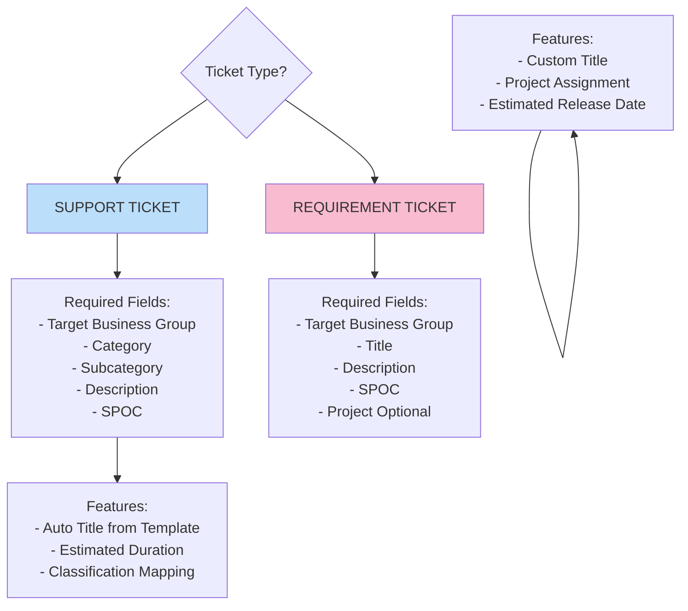
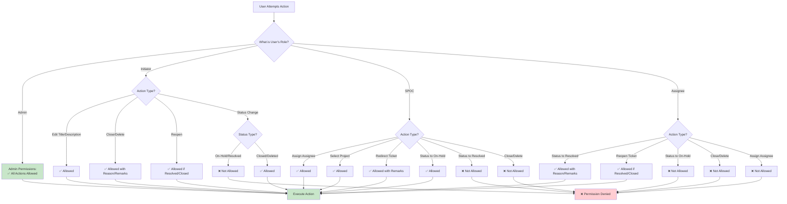
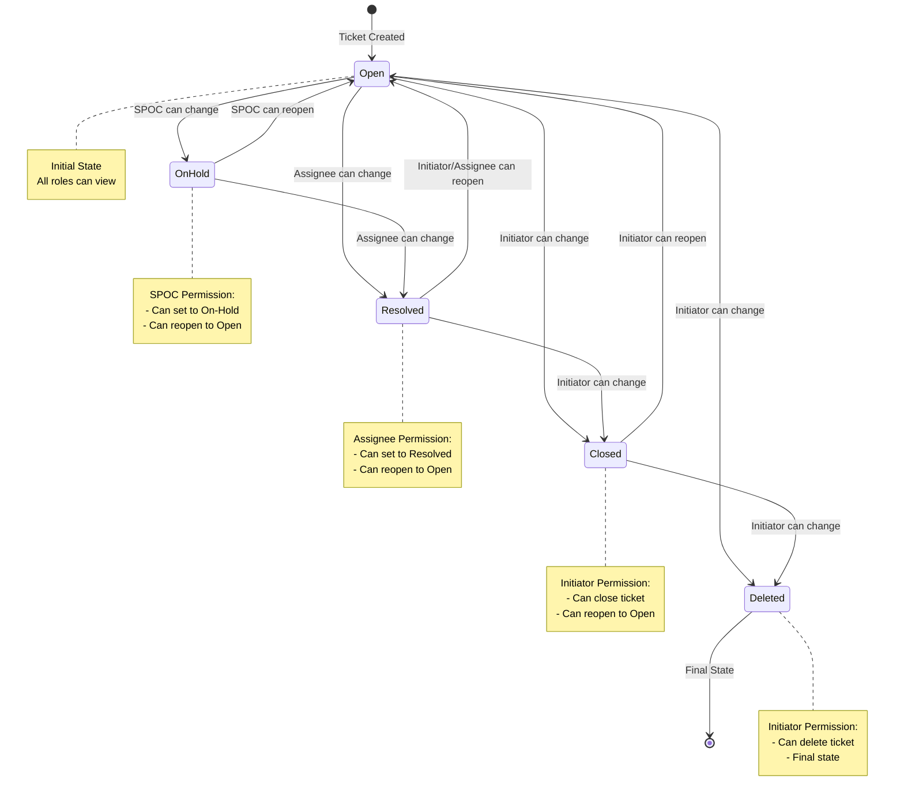
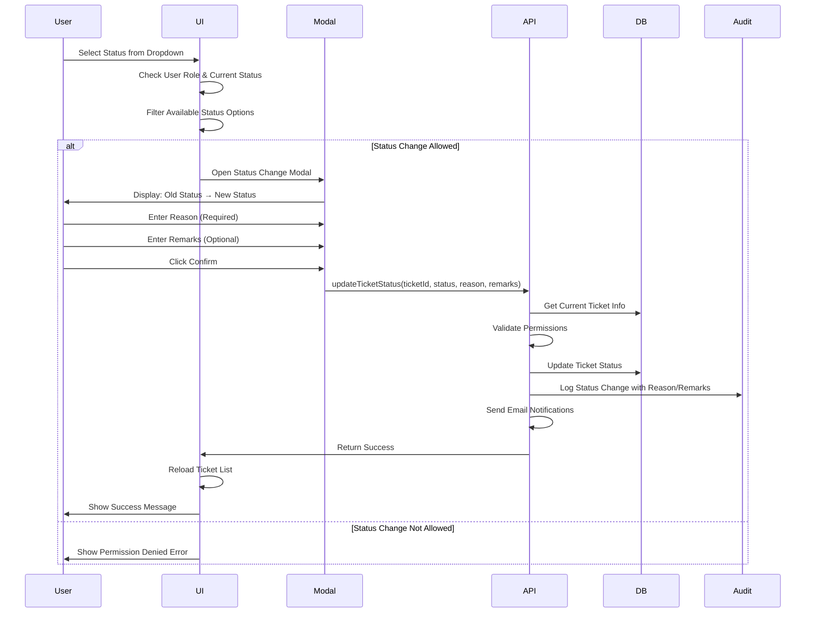
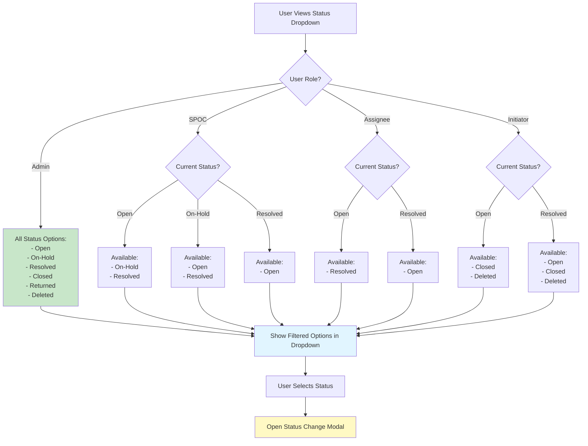
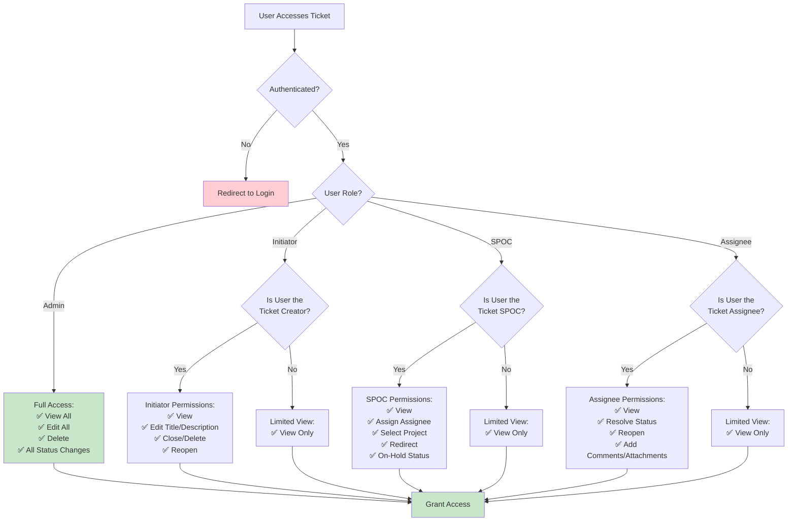

# Ticket Portal - Permissions & Flow Diagrams

## Table of Contents
1. [Ticket Creation Flow](#ticket-creation-flow)
2. [Ticket Differentiation](#ticket-differentiation)
3. [Permission Matrix](#permission-matrix)
4. [Status Change Flow](#status-change-flow)
5. [Role-Based Access Control](#role-based-access-control)

---

## Ticket Creation Flow



---

## Ticket Differentiation

### 1. Internal vs Customer Tickets



### 2. Support vs Requirement Tickets



### 3. Complete Ticket Classification Matrix

```
┌─────────────────────────────────────────────────────────────────┐
│                    TICKET CLASSIFICATION                        │
├─────────────────────────────────────────────────────────────────┤
│                                                                 │
│  Dimension 1: Internal vs Customer                             │
│  ┌─────────────────┬────────────────────────────────────────┐ │
│  │ Internal Ticket │ Customer Ticket                        │ │
│  ├─────────────────┼────────────────────────────────────────┤ │
│  │ • User has      │ • User has NO                          │ │
│  │   business_unit │   business_unit_group_id                │ │
│  │   _group_id     │ • External customer                     │ │
│  │ • Created by    │ • No initiator group                   │ │
│  │   internal user │ • is_internal = false                   │ │
│  │ • Has initiator │                                         │ │
│  │   group         │                                         │ │
│  │ • is_internal = │                                         │ │
│  │   true          │                                         │ │
│  └─────────────────┴────────────────────────────────────────┘ │
│                                                                 │
│  Dimension 2: Support vs Requirement                          │
│  ┌─────────────────┬────────────────────────────────────────┐ │
│  │ Support Ticket  │ Requirement Ticket                     │ │
│  ├─────────────────┼────────────────────────────────────────┤ │
│  │ • Category      │ • Title (required)                     │ │
│  │ • Subcategory   │ • Project (optional)                   │ │
│  │ • Description   │ • Estimated Release Date               │ │
│  │ • Auto Title    │ • Custom Title                         │ │
│  │   Template      │ • No Category/Subcategory              │ │
│  │ • Estimated     │                                         │ │
│  │   Duration      │                                         │ │
│  └─────────────────┴────────────────────────────────────────┘ │
│                                                                 │
│  Possible Combinations:                                       │
│  1. Internal Support Ticket                                    │
│  2. Internal Requirement Ticket                                │
│  3. Customer Support Ticket                                    │
│  4. Customer Requirement Ticket                                │
│                                                                 │
└─────────────────────────────────────────────────────────────────┘
```

---

## Permission Matrix

### Complete Permission Matrix Table

| Action | Admin | Initiator | SPOC | Assignee |
|--------|-------|-----------|------|----------|
| **Ticket Creation** | ✅ | ✅ | ✅ | ✅ |
| **Edit Title** | ✅ | ✅ | ❌ | ❌ |
| **Edit Description** | ✅ | ✅ | ❌ | ❌ |
| **Change Status to On-Hold** | ✅ | ❌ | ✅ | ❌ |
| **Change Status to Resolved** | ✅ | ❌ | ❌ | ✅ |
| **Change Status to Closed** | ✅ | ✅ | ❌ | ❌ |
| **Change Status to Deleted** | ✅ | ✅ | ❌ | ❌ |
| **Reopen Resolved/Closed** | ✅ | ✅ | ❌ | ✅ |
| **Assign/Reassign Assignee** | ✅ | ❌ | ✅ | ❌ |
| **Select Project** | ✅ | ❌ | ✅ | ❌ |
| **Redirect Ticket** | ✅ | ❌ | ✅ | ❌ |
| **Add Comments** | ✅ | ✅ | ✅ | ✅ |
| **Add Attachments** | ✅ | ✅ | ✅ | ✅ |
| **Delete Ticket** | ✅ | ✅ | ❌ | ❌ |
| **View Activity History** | ✅ | ✅ | ✅ | ✅ |

### Permission Flow Diagram



---

## Status Change Flow

### Status Change Permission Matrix



### Status Change with Modal Flow



### Dynamic Status Options by Role



---

## Role-Based Access Control

### User Role Hierarchy

```
┌─────────────────────────────────────────────────────────────┐
│                    USER ROLE HIERARCHY                       │
├─────────────────────────────────────────────────────────────┤
│                                                              │
│  ┌──────────────┐                                           │
│  │    ADMIN     │  ← Highest Privileges                     │
│  │              │     • All Actions Allowed                  │
│  │              │     • Can Override Any Permission          │
│  └──────────────┘                                           │
│         │                                                    │
│         ├─────────────────────────────────────┐             │
│         │                                     │             │
│  ┌──────────────┐                    ┌──────────────┐      │
│  │  INITIATOR   │                    │     SPOC     │      │
│  │              │                    │              │      │
│  │ • Created    │                    │ • Assigned   │      │
│  │   the ticket │                    │   to Target │      │
│  │ • Can close  │                    │   Business  │      │
│  │   & delete   │                    │   Group      │      │
│  │ • Can edit   │                    │ • Can assign│      │
│  │   title/desc │                    │   assignee   │      │
│  │              │                    │ • Can put on │      │
│  │              │                    │   hold       │      │
│  │              │                    │ • Can redirect│     │
│  └──────────────┘                    └──────────────┘      │
│         │                                     │             │
│         └─────────────────────────────────────┘             │
│                            │                                │
│                   ┌──────────────┐                          │
│                   │  ASSIGNEE    │                          │
│                   │              │                          │
│                   │ • Assigned to│                          │
│                   │   work on    │                          │
│                   │   ticket     │                          │
│                   │ • Can resolve │                          │
│                   │ • Can reopen  │                          │
│                   └──────────────┘                          │
│                                                              │
└─────────────────────────────────────────────────────────────┘
```

### Ticket Access Control Flow



---

## Key Differentiators Summary

### 1. Internal vs Customer Tickets

**Determination Logic:**
- **Internal Ticket**: `creator_business_unit_group_id IS NOT NULL`
  - User belongs to a Business Unit Group
  - Has `initiator_group_name` (from user's business_unit_group)
  - `is_internal = true`
  
- **Customer Ticket**: `creator_business_unit_group_id IS NULL`
  - External customer (no business unit group)
  - `initiator_group_name = null`
  - `is_internal = false`

### 2. Support vs Requirement Tickets

**Support Ticket:**
- Requires: Category, Subcategory, Description
- Uses: Auto Title Template, Estimated Duration
- Classification: Based on Target Business Group mapping

**Requirement Ticket:**
- Requires: Title, Description
- Optional: Project, Estimated Release Date
- No Category/Subcategory classification

### 3. Permission Determination

**User Roles in Context:**
- **Initiator**: User who created the ticket (`created_by`)
- **SPOC**: User assigned as SPOC for the Target Business Group (`spoc_user_id`)
- **Assignee**: User assigned to work on the ticket (`assigned_to`)
- **Admin**: User with role = 'admin'

**Permission Check Flow:**
1. Check if user is Admin → Full access
2. Check if user is Initiator → Initiator permissions
3. Check if user is SPOC → SPOC permissions
4. Check if user is Assignee → Assignee permissions
5. Default → View only

---

## Status Change Rules Summary

| Current Status | SPOC Can Change To | Assignee Can Change To | Initiator Can Change To |
|----------------|-------------------|----------------------|----------------------|
| **Open** | On-Hold, Resolved | Resolved | Closed, Deleted |
| **On-Hold** | Open, Resolved | Resolved | Closed, Deleted |
| **Resolved** | Open | Open | Open, Closed, Deleted |
| **Closed** | - | - | Open, Deleted |
| **Deleted** | - | - | - |

**Note:** All status changes require Reason (mandatory) and Remarks (optional) through the Status Change Modal.

---

## Audit Trail

All actions are logged with:
- **Action Type**: created, status_change, assignment_change, project_change, redirection, comment_added
- **Old Value**: Previous state
- **New Value**: New state
- **Performed By**: User ID and Name
- **Notes**: Additional context (reason, remarks, etc.)
- **Timestamp**: When the action occurred

---

*Last Updated: Based on current codebase implementation*
